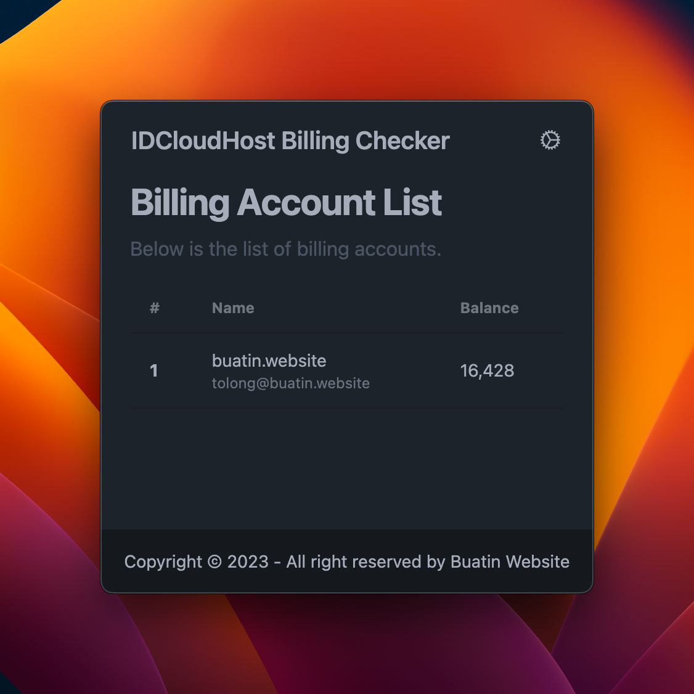

<br/>
<p align="center">
  <a href="https://github.com/Buatin-Website/idcloudhost-billing-checker">
    
  </a>

<h3 align="center">IDCloudhost Billing Checker</h3>

  <p align="center">
    Desktop Apps untuk Membantu Pengecekan IDCloudhost Balance
    <br/>
    <br/>
  </p>
</p>

  

## Table Of Contents

* [About the Project](#about-the-project)
* [Built With](#built-with)
* [Getting Started](#getting-started)
    * [Prerequisites](#prerequisites)
    * [Installation](#installation)
* [Usage](#usage)
* [Contributing](#contributing)
* [License](#license)
* [Authors](#authors)
* [Acknowledgements](#acknowledgements)

## About The Project



IDCloudhost Billing Checker adalah aplikasi desktop yang memudahkan pengguna dalam memantau dan mengelola saldo akun IDCloudhost. Aplikasi ini memiliki fitur utama berupa daftar akun billing beserta saldonya, serta pengingat saat saldo mendekati batas minimum yang ditentukan.

Fitur Utama:

- Daftar Akun Billing dan Saldo: Aplikasi ini menyajikan daftar lengkap akun billing IDCloudhost beserta saldo aktualnya. Pengguna dapat dengan mudah melihat dan memantau saldo masing-masing akun dalam satu tampilan yang terorganisir.

- Pengingat Batas Saldo: IDCloudhost Billing Checker akan memberikan pengingat kepada pengguna ketika saldo suatu akun mendekati atau melewati batas saldo minimum yang telah diatur sebelumnya. Ini membantu pengguna untuk mengambil tindakan yang diperlukan secara tepat waktu.

- Antarmuka Intuitif: Aplikasi ini memiliki antarmuka yang sederhana dan mudah digunakan, memungkinkan pengguna untuk menjalankan fungsi-fungsi tersebut dengan cepat dan tanpa kesulitan.

## Built With

Aplikasi ini dikembangkan menggunakan tiga komponen utama yang bekerja secara sinergis untuk memberikan pengalaman pengguna yang optimal: Native PHP, framework Laravel, dan Livewire.

## Getting Started

Untuk menjalankan aplikasi ini secara lokal, ikuti langkah-langkah berikut:

### Prerequisites

* PHP 8.1 atau versi lebih baru
* Composer
* NPM

### Installation

1. Dapatkan API Key dari IDCloudhost

2. Clone repository ini

```sh
git clone https://github.com/Buatin-Website/idcloudhost-billing-checker.git
```

3. Install Composer Packages

```sh
composer install
```

4. Install NPM packages

```sh
npm install
```

5. Copy file *.env.example* menjadi *.env*

6. Generate APP_KEY

```sh
php artisan key:generate
```

8. Jalankan aplikasi

```sh
php artisan native:serve
```

## Contributing

Dengan senang hati kami menerima kontribusi dari siapa saja, termasuk Anda! Ada beberapa cara untuk berkontribusi pada proyek ini.

### Creating A Pull Request

1. Fork proyek ini
2. Buat branch baru (`git checkout -b feature/AmazingFeature`)
3. Commit perubahan Anda (`git commit -m 'Add some AmazingFeature'`)
4. Push ke branch (`git push origin feature/AmazingFeature`)
5. Buat Pull Request

## License

Distributed under the MIT License. See [LICENSE](https://github.com/Buatin-Website/idcloudhost-billing-checker/blob/main/LICENSE.md) for more information.
